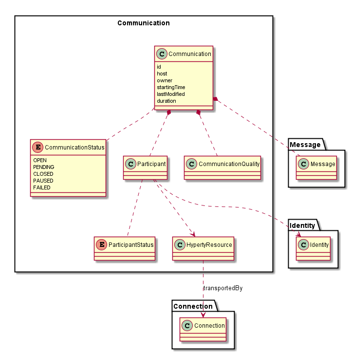
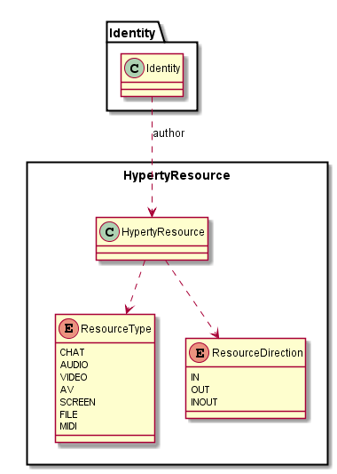

### Communication Data Model

The Communication Data Model is used to model the reTHINK Communications. The Communication data model is handled by Messaging Services functionality and also by Communicator type Hyperties.

Only The Connection objects are mandatory by using W3C standardized interfaces/classes including RTCICECandidate and RTCSessionDescription classes.

#### Communication Control Model

The conventional Offer-Answer Communication Control model proposed by JSEP implies the usage of specific messages to handle the offer and response of communication using messages like Invite, Accept, Bye. This approach is quite mature but [constrains very much the use cases to be supported](http://blog.webrtc.is/2013/03/06/sdp-the-webrtc-boat-anchor/).

Another approach is to model communication and connections as a resource tree model as defined above and peers use CRUD generic operations to be synchronised and control the communication eg Create Conversation Resource and create Conversation Participant to add a new peer joined with access control authorisation policies to handle who may join the conversation. In principle, this model is more open to innovation imposing less restrictions to add new features then the conventional one.

The analysis of this pattern to support a Communication setup is done [here](data-synch-communication-model.md)

#### Hyperty Resource

The Hyperty Resource Data Model is used by the Communication Data Model to model Resources shared in reTHINK Communications e.g. user audio, user video, files, chat messages, etc. The Hyperty Resource data model is handled by Messaging Services functionality and also by Communicator type Hyperties.

This model is compliant with W3C MediaStream API.
