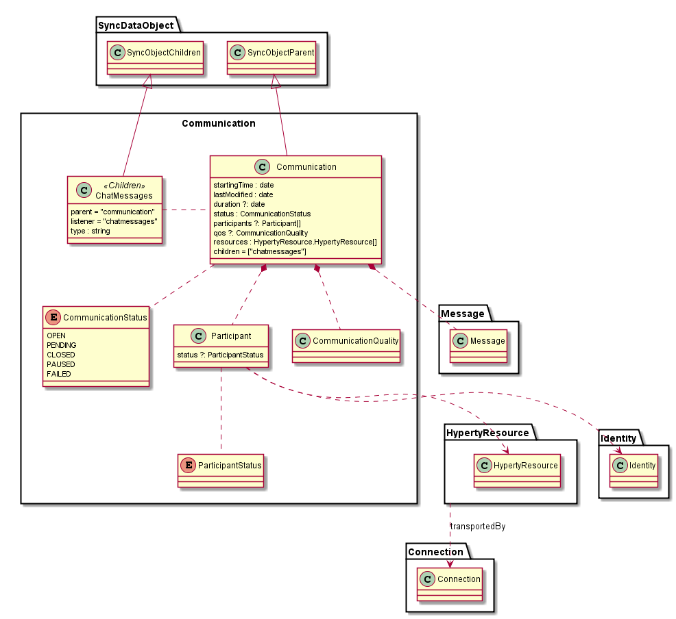
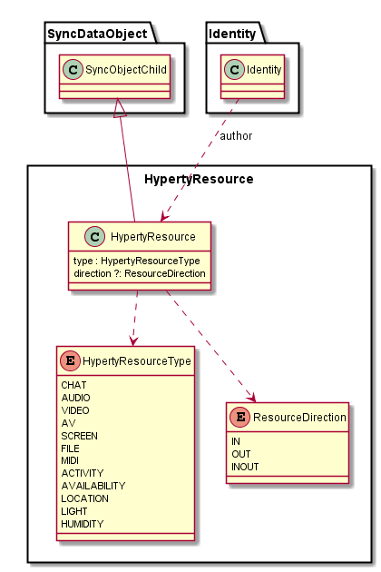

### Communication Data Model

The Communication Data Model is used to model the reTHINK Communications.

**starting time:** when communication is opened the first time
**last modified:** last change in the communication like new participant added or last message sent
**duration:** period of time between the first "OPEN" status and the last "CLOSED" status.
**status:** status of the communication. See CommunicationStatus below
**participants:** list of participants in the Communication (see below)
**qos:** *to be provided*
**resources:** list of ResourceTypes supported by the communication. See below
**children = ["chatmessages"]:** definition of ChatMessages as a SyncObjectChildren of Communication (see below)

#### CommunicationStatus

**OPEN:** Hyperty Resources can be shared in the communication
**PENDING:** Communication was created but no invited user as subscribed yet
**CLOSED:** Hyperty Resources can be shared in the communication
**PAUSED:** *skip?*
**FAILED:** communication creation failed for some reason eg no subscription received

#### Hyperty Resource

The Hyperty Resource Data Model is used by the Communication Data Model to model Resources shared in reTHINK Communications e.g. user audio, user video, files, chat messages, etc. The Hyperty Resource data model is handled by Messaging Services functionality and also by Communicator type Hyperties.

This model is compliant with W3C MediaStream API.
