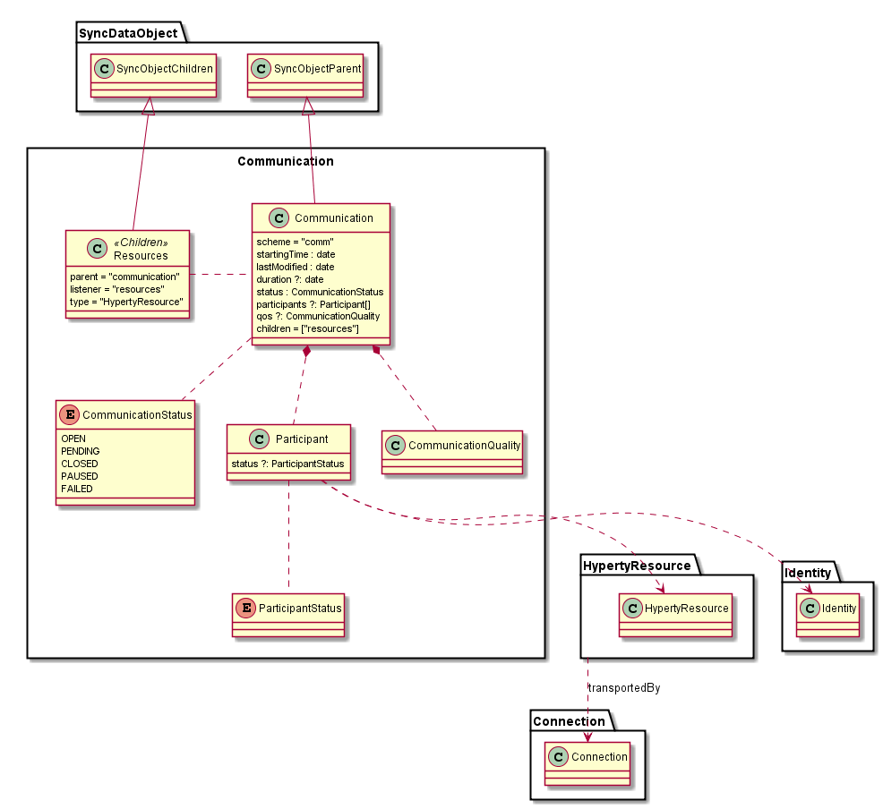

### Communication Data Model

The Communication Data Model is used to model the reTHINK Communications.

**starting time:** when communication is opened the first time

**last modified:** last change in the communication like new participant added or last message sent

**duration:** period of time between the first "OPEN" status and the last "CLOSED" status.

**status:** status of the communication. See CommunicationStatus below

**participants:** list of participants in the Communication (see below)

**qos:** *to be provided*

**resources:** list of ResourceTypes supported by the communication. See below

**children = ["chatmessages"]:** definition of ChatMessages as a SyncObjectChildren of Communication (see below).

  **Note:** more types of resources cna be shared in a communication. The following syntax is proposed `<HypertyResourceType>-resources`. Examples:

  - `chat-resources` for chat messages
  - `file-resources` for shared files
  - `video-resources` for recorded video communication

#### CommunicationStatus

**OPEN:** Hyperty Resources can be shared in the communication

**PENDING:** Communication was created but no invited user has subscribed yet

**CLOSED:** Hyperty Resources can be shared in the communication

**PAUSED:** *skip?*

**FAILED:** communication creation failed for some reason eg no subscription received
