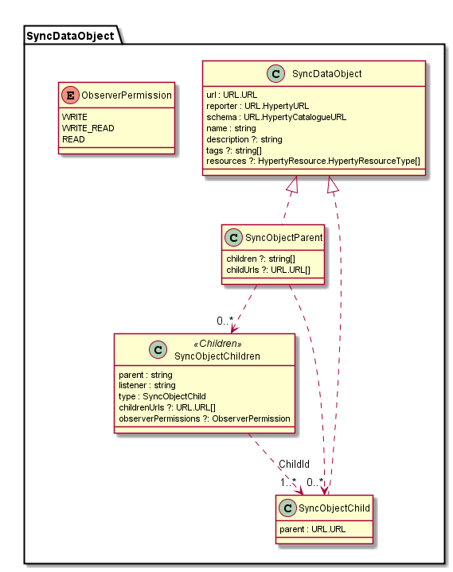

### Sync Data Object Model

The SyncDataObject Model is used to specify the JSON format used in the [Reporter-Observer data synchronisation communication mechanism](../../manuals/p2p-data-sync.md) used to support Hyperty Interoperability at run time.

**Reporter** contains the Reporter Hyperty URL

**schema** contains the CatalogueURL for the JSON Schema describing the Sync Object

**SyncObjectParent** is a SyncObject that contains SyncObjectChildren

**SyncObjectChildren** contains the **children** attribute that is a list of SyncObjectChild URLs

**SyncObjectChild** is a SyncObject that can be created by an observer of the SyncObjectParent.

