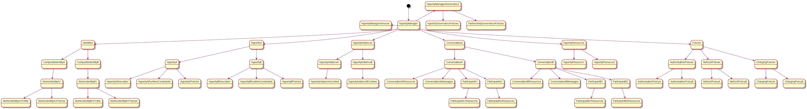

## [State of the Art](DataModel_StateOfTheArt.md)

## reTHINK Data Resources

<!--
@startuml "hyperty-resource-tree.png"

[*] -down-> HypertyManager

HypertyManager -up-> HypertyManagerGovernance

HypertyManagerGovernance -down-> HypertyGovernancePolicies

HypertyManagerGovernance -down-> PartnershipGovernancePolicies

HypertyManager -left-> HypertyManagerServices

HypertyManager -down-> Identities

Identities -down-> CompositeIdentityA
CompositeIdentityA -down-> AtomicIdentityA1

AtomicIdentityA1 -down-> AtomicIdentityA1Profile
AtomicIdentityA1 -down-> AtomicIdentityA1Policies

Identities -down-> CompositeIdentityB
CompositeIdentityB -down-> AtomicIdentityB1

AtomicIdentityB1 -down-> AtomicIdentityB1Profile
AtomicIdentityB1 -down-> AtomicIdentityB1Policies

HypertyManager -down-> Hyperties

Hyperties -down-> HypertyA
Hyperties -down-> HypertyB

HypertyA -down-> HypertyADescriptor
HypertyB -down-> HypertyBDescriptor

HypertyA -down-> HypertyARuntimeConstraints
HypertyB -down-> HypertyBRuntimeConstraints

HypertyA -down-> HypertyAPolicies
HypertyB -down-> HypertyBPolicies

HypertyManager -down-> HypertyInstances

HypertyInstances -down-> HypertyInstanceA
HypertyInstances -down-> HypertyInstanceB

HypertyInstanceA -down-> HypertyInstanceAContext
HypertyInstanceB -down-> HypertyInstanceBContext

HypertyManager -down-> Conversations

Conversations -down-> ConversationA
ConversationA -down-> ConversationAResources
ConversationA -down-> ConversationAMessages

ConversationA -down-> ParticipantA1
ParticipantA1 -down-> ParticipantA1Resources

ConversationA -down-> ParticipantA2
ParticipantA2 -down-> ParticipantA2Resources

Conversations -down-> ConversationB

ConversationB -down-> ConversationBResources
ConversationB -down-> ConversationBMessages

ConversationB -down-> ParticipantB1
ParticipantB1 -down-> ParticipantB1Resources

ConversationB -down-> ParticipantB2
ParticipantB2 -down-> ParticipantB2Resources

HypertyManager -down-> HypertyResources

HypertyResources -down-> HypertyResource1
HypertyResources -down-> HypertyResource2

HypertyManager -down-> Policies

Policies -down-> AuthorisationPolicies

AuthorisationPolicies -down-> AuthorisationPolicyA
AuthorisationPolicies -down-> AuthorisationPolicyB

Policies -down-> NetQoSPolicies

NetQoSPolicies -down-> NetQoSPolicyA
NetQoSPolicies -down-> NetQoSPolicyB

Policies -down-> ChargingPolicies

ChargingPolicies -down-> ChargingPolicyA
ChargingPolicies -down-> ChargingPolicyB

@enduml
-->

### Hyperty Domain

Data about the administrative domain where Hyperties belong including:

* Id
* domain-name
* operational data eg management services addresses including:
 * Identity Management including Authentication, Authorisation service addresses
 * Registry
 * Repository including service endpoint to retrieve messagingStubUrl
 * QoS Server
 * STUN/TURN servers

### [Identity](identity.md)

Data about Tangible Entities (subscribers, things,..) including:
* type eg human, organisation, physical space, physical object
* atomic or composite eg individual or group
* Identifiers
* geo location (if static eg for physical spaces)
* Authentication data (tokens?) and policies
* Authorisation data (tokens) and policies
* Subscribed Hyperties or Access Control Policies to Hyperties (?)
* Identity specific policies for Hyperties including:
  * access control
  * qos
  * charging
* private / public groups
* service addresses. Some of these addresses can also be used as identifiers. Examples:
 * notificationAddress: used to reach the identity when offline eg through W3C Push API
 * publicContextAddress: Authorised Context Consumers have to listen on this address to receive updates about Identity context
 * privateContextAddress: address used by the Identity to publish its context. **question:** is this dynamic?
 * E164 tel
 * VoIP SIP
 * email
 * twitter
 * etc
* Tangible Entities Profile Data eg:
 * username
 * complete name
 * photo / avatar
 * birthday
 * etc

### [Hyperty Catalog / Repository](hyperty.md)

Data about available Hyperties:
 * Id
 * Textual description
 * Type eg Communicator (for H2H communications): can we derive Hyperty type by the Hyperty schemas supported?
 * Supported Hyperty Schemas (URL for Hyperty Schemas?)
 * runtime constraints : describe minimum resources to be supported by the runtime eg webrtc engine, mic and speaker (should we have runtime schema?)
 * Policies including (use Policy schema)
   * access control
   * qos
   * charging
   * ...
 * Configuration Data that will depend on the Hyperty type eg:
  * Data Codecs to be used
  * Boolean parameters about how to record service activity including messages exchanged between Hyperties

### [Hyperty Instances](hyperty-instance.md)

Data about Hyperty instances
* HypertyId : identifies the Hyperty from the repository that is instantiated
* Identity Identifier: identifies the User Entity associated with the Hyperty Instance (do we use a token?)
* HypertyInstanceAddress : internal messaging address to reach the Hyperty Instance
* domainURLs : list of domain URLs from other Hyperty instances running in the same Runtime instance. Useful for inter-domain discovery purposes. Check step 9 at [Inter-domain Bob discovery](https://github.com/reTHINK-project/architecture/blob/master/docs/dynamic-view/H2H%20Communication/UC95-1-discover_bob.md).
* instantiation Time: when the Hyperty instance registered
* lastModified: the last time Hyperty Instance updated its status
* deviceType/deviceModel: use WURFL? (http://wurfl.sourceforge.net/) 
* user-agent -> to be taken from HTTP headers according to http://tools.ietf.org/html/rfc7231#section-5.5.3 
* connection status : connected \ not connected, QoS (eg latency, bandwidth)?
* mediaConnectionDescription : SDP + ICE Candidates?
* RuntimeResourcesDescription : information about available resources eg mic, camera, sensors, etc (should we have runtime schema?)
* presence status : online, busy, away, etc
* context : data collected from sensors .. (see Context Data Model) 

### [Communication](communication.md)

Data about communication / conversations among Hyperties
* Id - guid
* host - Identity that hosted the communication
* owner - Identity that created the communication
* status - eg open, pending, closed, paused, failed etc
* participants - list of Identities involved in the communication. **Question:** Should we list Hyperty Instances instead? This can be useful for active conversation eg to join, resume, etc
* subject 
* startingTime
* lastModified
* duration
* resources : see Hyperty Resource Data Model 
* messages : all messages exchanged among Hyperty Instances
* quality : measurement about the communication qos

### [Hyperty Resource](hyperty-resource.md)

Hyperty Resources shared in the communication eg chat, files, or any other shareable digital asset:
* Resource Type - Chat, Voice, Video, Screen, File, MIDI, etc
* Direction - in, out, inout
* ...

### Context

based on M2M metadatamodel standard? 

### [Addresses](address-model.md)

### Policies

* Type : access control, qos, charging, ...
* conditions : regular expression??
* actions : eg boolean, Hyperty URLs to be executed, Principals to be routed to, etc 

### Governance

Data about Hyperty life-cycle management and Partnership life-cycle management
