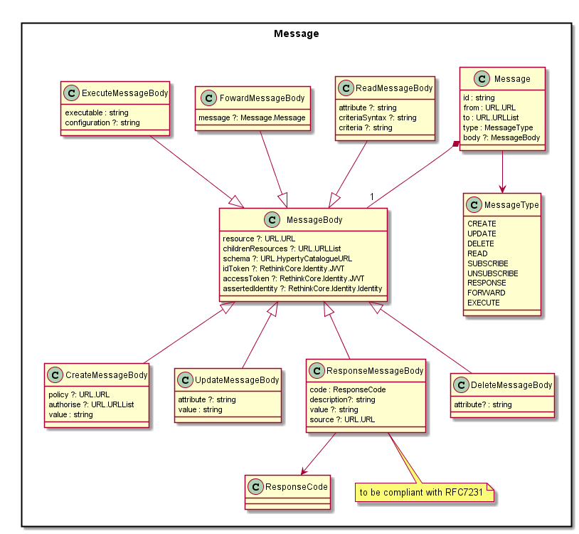

Message Model
-------------

Header
------

Fields needed to route messages.

#### id

To be used to associate Response messages to the initial request message.

#### type

Message type that will be used to define the Message Body format.

#### from

[URL](../address/readme.md) of Hyperty instance or User associated with it

#### to

One or more [URLs](../address/readme.md) of Message recipients. According to the URL scheme it may be handled in different ways

### Message Body

Optionaly, all message bodies exchanged between different Runtime Messge BUS can contain JWT tokens for Access Control for Identity Assertion purposes that are inserted by the Identity Module before the message is routed to protostubs.

When these message bodies reach the destination MessageBUS, the JWT tokens are decoded and verified by the Identity Module. The result of this process (if successful) is inserted in the MessageBody as assertedIdentity objects and the JWT tokens removed, before the message is delivered to the Hyperty. AssertedIdentity is compliant with [User Identity Data Model](https://github.com/reTHINK-project/dev-service-framework/tree/master/docs/datamodel/user-identity).

The "MessageBody.via" attribute contains a list of all Protostub addresses (Protostub) that the message has been passed through. It is used to prevent infinite cycles in the Hyperty Messaging Framework.

#### CreateMessageBody

##### value

Contains the created object in JSON format.

##### policy

URL from where access policy control can be downloaded. Examples:

1.	reporter-observer where only reporter can make changes

2.	similar to previous one but observers can request reporters to make changes

Policy to be enforced by Monitor component colocated with Connector sandbox?

#### ResponseMessageBody

##### Code

A response code compliant with HTTP response codes (RFC7231).

##### Description

Description of response code compliant with HTTP response codes (RFC7231).

##### Value

Contains a data value in JSON format. Applicable to Responses to READ MessageType.

##### Source

Contains the original creator of the response. Useful to identify the real source of the response to a one-to-many message delivery ie multiple responses coming coming from different sources.

#### ReadMessageBody

##### attribute

Identifies the attribute in the Object to be read (optional)

##### criteriaSyntax

Defines the criteria syntax used in criteria field. To be used for search purposes. Valid criteria Syntaxes are: "key-value", "mongodb", "sql"(?), ...

##### criteria

Defines the criteria to be used for search purposes. Syntax used to define the criteria is set in the criteriaSyntax.

#### UpdateMessageBody

##### attribute

Identifies the attribute in the Object that is updated (optional)

##### value

Contains the updated value object in JSON format.

#### DeleteMessageBody

##### attribute

Identifies the attribute in the Object that is deleted (optional)

#### FowardMessageBody

##### message

Contains forwarded message.

### Procedures

#### Request - Response transactions

A Response to a Request message should follow this rule:

-	Response.from = Request.to
-	Response.to = Request.from
-	Response.id = Request.id

It should be note, the Request.id MUST be incremented every time a new Request message is created.
