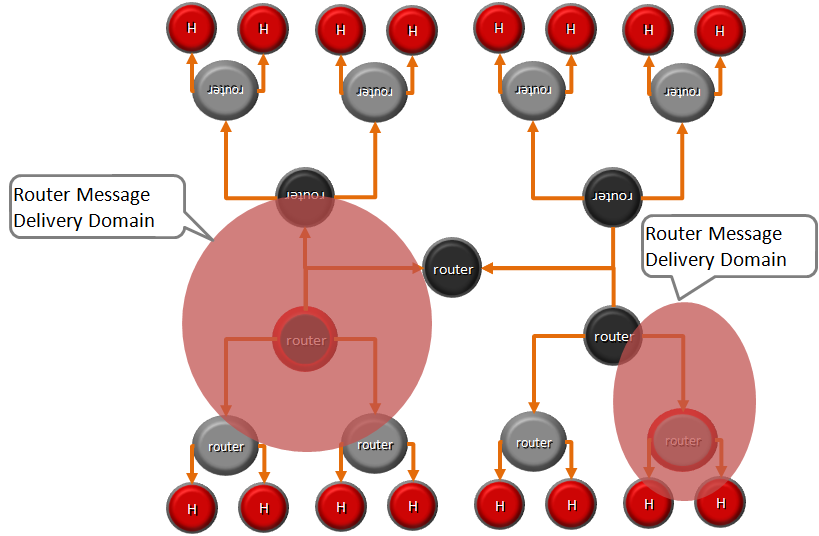

Hyperty Messaging Framework powered by Protofly (Adhoc MOM)
-----------------------------------------------------------

This document gives an overview on the Messaging Framework (*note to be removed: I guess Messaging Framework is a more friendly term for web developers than Messaging Middleware*) technical solution used to support Hyperty's interaction through the higher level [Data Synchronisation Reporter - Observer communication mechanism](p2p-data-sync.md). Details about how to develop Hyperties is provided in [this](development-of-hyperties.md) document.

Hyperties cooperate each other with a Resource Oriented Messaging model implemented by a simple Messaging Framework. The Hyperty Messaging Framework, supports different messaging patterns including publish/subscribe and request/response messaging patterns. The higher level [Reporter - Observer communication pattern](p2p-data-sync.md) works on top of these basic messaging patterns. It should be noted, that [Hyperty Service Development Framework](development-of-hyperties.md) to be used to create new Hyperties, abstracts Developers from the Hyperty Messaging Framework (*note to be removed: too many Frameworks?*) described in this document including lower level Hyperty Messaging APIs.

The Message delivery is based on a simple message Router functionality that performs a lookup for listeners registered to receive the Message (the ["Message.to" Header field](https://github.com/reTHINK-project/dev-service-framework/blob/develop/docs/datamodel/message/readme.md#to) is the only information looked up for). The Message is posted to all found listeners, which can be other Routers or end-points (Hyperties). Thus, the Hyperty Messaging Framework is comprised by a network of Routers where each Router only knows adjacent registered Routers or end-points.

Listeners are programmaticaly registered and unregistered by Routing Management functionalities, which decide the listeners to be added according to a higher level view of the Routing Network.

The Messaging Framework works at three layers:

At the Runtime Sandbox level where Hyperties are executing, message delivery is provided by the [MiniBUS component](https://github.com/reTHINK-project/dev-runtime-core/blob/master/src/bus/MiniBus.js).

At the Runtime level where Sandboxes are hosted (e.g. in a Browser or in a NodeJS instance), message delivery is provided by the [Message BUS component](https://github.com/reTHINK-project/dev-runtime-core/blob/master/src/bus/MessageBus.js), which is an extension of the MiniBUS.

At Domain Level, message delivery is provided by the Message Node functionality by using the Protofly mechanism (*link to protofly description*), i.e. communication between Message BUS and Message Nodes and among Message Nodes are protocol agnostic. This also means that the Message Node can be provided by any Messaging solution as soon as there is a Protostub available (*link to protofly description*). Currently, a [Vertx Message Node](https://github.com/reTHINK-project/dev-msg-node-vertx), a [Matrix Message Node](https://github.com/reTHINK-project/dev-msg-node-matrix) and a [NodeJS Message Node](https://github.com/reTHINK-project/dev-msg-node-nodejs) are provided. Details about how to develop a new Message Node and associated Protostub is provided in [this](development-of-protostubs-and-msg-nodes.md).

It is also possible to have P2P communication between Message BUS from different Hyperty Runtime without using any Message Node server (planned for phase 2). P2P Communication between Message BUS will also be based on the protofly mechanism.

At runtime level (MessageBUS and MiniBUS), it is used a standard CRUD based [JSON Message Model](../datamodel/message/readme.md), which is easily mapped into Restfull APIs.

### Protocol on-the-fly (protofly) and Protostubs

Protocol on-the-fly leverages the code on-demand support by Web runtimes (eg Javascript), to dynamically select, load and instantiate the most appropriate protocol during run-time. Such characteristic enables protocols to be selected at run-time and not at design time, enabling protocol interoperability among distributed services, promoting loosely coupled service architectures, optimising resources spent by avoiding the need to have Protocol Gateways in service's middleware as well as minimising standardisation efforts.

Definition of terms:

**Protocol Stub:** the implementation of the protocol stack e.g. javascript file, that can be dynamically loaded and used to support interoperability between distributed services. Replaces the term **Messaging Stub** as used in the SigOfly concept;

**Messaging Services:** an intermediate server to route messages exchanged between distributed services. Each Messaging Service instance belongs to a domain;

**Hosting Messaging Services**: is the Messaging Service that is used to support the exchange of all messages among distributed services belonging to different domains. The Hosting Service uses the Domain Message Interface to exchange messages, while other remote services use Transient Message Interfaces that connect to the Hosting Messaging Server.

**Proxy Protocol Stub:** is a Protocol Stub that is deployed in a "foreign" device i.e. it is downloaded from a Catalogue server that does not belong to the Device domain. It provides the bridge between Hyperties running in the "foreign" device and the hyperties running in the "hosting" device.

The different types of interfaces supported by ProtOfly are:

**ProtOfly Domain Message Interface:** the communication channel that is established with domain’s messaging server as soon as a domain‘s user is loggedin;

**ProtOfly Transient Message Interface:** the communication channel that is established, typically with a foreign messaging server (i.e. from another domain) in scope of a inter-domain service interoperability;

**ProtOfly P2P Messaging Interface:** a P2P communication channel that is directly established between two distributed services without using any Message Server in between.

**ProtOfly Client-Server Interface:** a communication channel between two distributed services without using Messaging Services in between, supported on a Client-Server protocol e.g. HTTP Rest Interface.

The different ProtOfly types of interfaces are depicted in the figure below:

Besides the WebRTC Signalling Use Cases via Message Services supported by the SigOfly, the ProtOfly can also support the following Use Cases:

-	WebRTC P2P Signalling using a ProtOfly P2P Messaging Interface
-	WebRTC IdP Proxy using a ProtOfly Client-Server Interface to support communication with a remote Identity Management Server.
-	Service Registration and Service Discovery using a ProtOfly Client-Server Interface to support communication with a remote Registry Server.

### Main procedures

Let’s use the classic Alice and Bob example to better explain the concept assuming they are registered in different Service Provider domains. In case Alice wants to talk to Bob by using Bob’s identifier e.g. bob@domain.com, the following steps will be performed:* Information about the Identity of Bob including Bob’s Protocol Stub URL is provided and asserted by Bob’s IdP,* Alice downloads and instantiates Bob’s Protocol Stub in her browser to setup a Transient Channel with Bob’s domain Messaging Server,* As soon as the Transient Message Interface channel is established, Alice can send an Invitation message to Bob containing her SDP offer,* Since Bob is connected in the same Messaging Service via his Domain Message Interface channel, he will receive Alice’s invitation in his Browser. If Bob accepts the invitation, an Accepted message containing Bob SDP response will be send to Alice.* As soon as Alice’s browser receives Bob’s SDP, the media and/or data streams can be directly connected between the two browsers.

This scenario implies that, since the Conversation is hosted by the called party by using its Messaging Service, the called party domain is spending more resources than the calling party domain. In case this solution is not acceptable, Conversations can also be hosted by calling parties. The main differences are:

-	A notification service endpoint like supported on emerging [IETF/W3C Web Push protocol](https://datatracker.ietf.org/doc/draft-ietf-webpush-protocol/) is asserted from Bob’s IdP which is used to push an invitation message towards Bob device,
-	The Identity of Alice including Alice’s Protocol Stub URL is provided and asserted by Alice’s IdP,
-	In case Bob accepts Alice invitation, Bob downloads and instantiates Alice’s Protocol Stub in her browser to setup a Transient Message Interface channel with Alice’s domain Messaging Service
-	As soon as the Transient Channel is established, Bob can send an ACCEPTED message to Alice containing her SDP offer.
-	Since Alice is connected in the same Messaging Service via her Domain Message Interface channel, she will receive Bob’s SDP and the media and/or data streams can be directly connected between the two browsers.

**Conversation Hosted by calling peer**

The protocol on-the-fly concept can also be applied to support interoperability with legacy networks (e.g. IMS and PSTN) by using a Messaging GW that will convert the signaling protocol used in the WebRTC device into the signaling protocol used in the legacy network.

### Message Delivery between different Hyperty Runtimes

Communication between the Message BUS and Message Nodes are provided by a Protostub that implements the protocol stack used to interact with the Message Node e.g. JSON over Websockets or a Restfull API Client. Listeners of protostubs are registered in the MessageBUS for a set of Message recipient addresses, usually a Hyperty Domain like `domain://example.com`.

When the MessageBUS is processing a new message and looking up routing paths for an address that is not local (eg `hyperty://example.com/alice-hyperty`), it won't find any registered listeners. In this case, the MessageBUS will ask the Runtime Registry (*point link here*) to resolve the "Message.to" header field, which will look for registered Protostubs that are able to deliver messages to such non-local address. If successful, the Registry will return the Hyperty Runtime protostub address and the MessageBUS will look up again for the protostub listener registered for its address.
