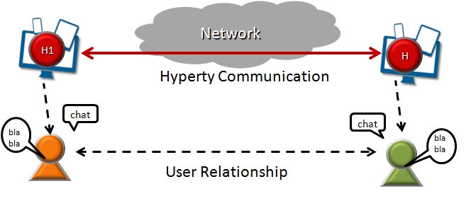

Hyper-linked Entities - Hyperties
---------------------------------

Hyperties are cooperative [Microservices](http://martinfowler.com/articles/microservices.html) that are executed in devices on behalf of users through simple but sophisticated Identity Management techniques. This means, Hyperties are independently deployable components each one providing a small set of business capabilities, using the *smart endpoints and dumb pipes* philosophy i.e. Hyperties don't depend on complex and sophisticated communication middleware like Enterprise Service BUS (ESB). Instead, Hyperties rely on a very light but powerful [Messaging On-the Fly Middleware](momfly.md) concept).

On the other side, Hyperties follow emerging [Edge](https://en.wikipedia.org/wiki/Edge_computing) and [Fog](https://en.wikipedia.org/wiki/Fog_computing) computing paradigms as opposed to more popular Cloud Computing. This means, when compared with Cloud Computing, Hyperties promotes a more effective usage of computing and network resources, decreases communication latency, improves security and extends scalability.

However, Hyperties can also be executed in Network Edge Servers for specific Business Capabilities (e.g. Media Servers) or when End-user devices don't have enough capabilities in terms of computing resources and/or power.

In addition, Hyperties have some unique characteristics including:

-	Hyperties are programmed in Javascript ECMA5/6, i.e. any existing device featuring a Browser or a NodeJS can be used today to execute Hyperties without requiring the installation of any new software. This means, **billions of devices** are already Hyperty enabled and ready to make part of reTHINK ecossystem.
-	The User Identity associated to an Hyperty is decoupled from the Hyperty Service Provider. Ie Identity Management is handled under the scene and the Developer does not have to care about it and just have to focus on the development of Business Capabilities. This also means, the end-user has the power to decide which is the Identity to be securely associated to a certain Hyperty instance. *put link*
-	Hyperties cooperate and communicate each other via P2P Synchronisation of Hyperty JSON Data Objects supported by the novel Reporter - Observer communication pattern *put link*.  

The API to handle the Synchronisation of Hyperty Data Objects is extremely simple and fun to use. The Developer of the Hyperty Reporter just has to create the Data Sync object with the Syncher API, and write on the object every time there is data to be updated and shared with Hyperty Observers.

*Reporter code snippet*

On the Hyperty Observer side, Data Objects are also created with the Syncher API and the emerging [Object.observer() Javascript method](https://developer.mozilla.org/en-US/docs/Web/JavaScript/Reference/Global_Objects/Object/observe) is used to receive the stream of data changes coming from the Reporter Hyperty.

*Observer code snippet*

-	Hyperties can easily cooperate with Hyperties from other domains with no federation required or the standardisation of Protocols thanks to the [Protocol On-the Fly powered Middleware](momfly.md). Hyperties only have to agree on a common json-schema for one or more Hyperty Data Objects, in order to be able to cooperate each other.

-	Hyperties can be used on any Application Domain, but they are specially suitable for Real Time Communication Apps (eg Video Conference and Chat) as well as IoT Apps.

**Examples**
