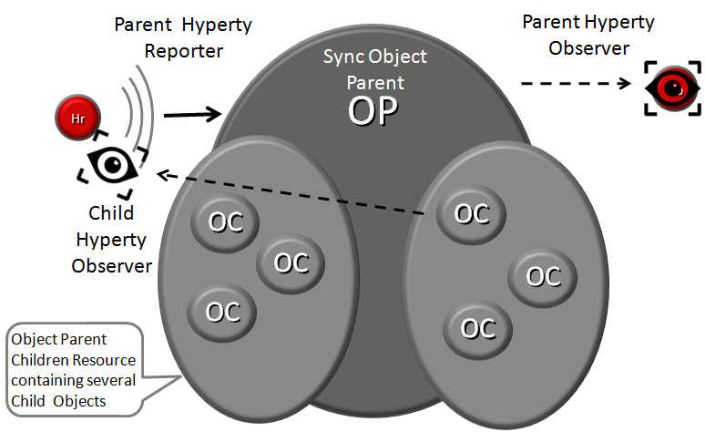
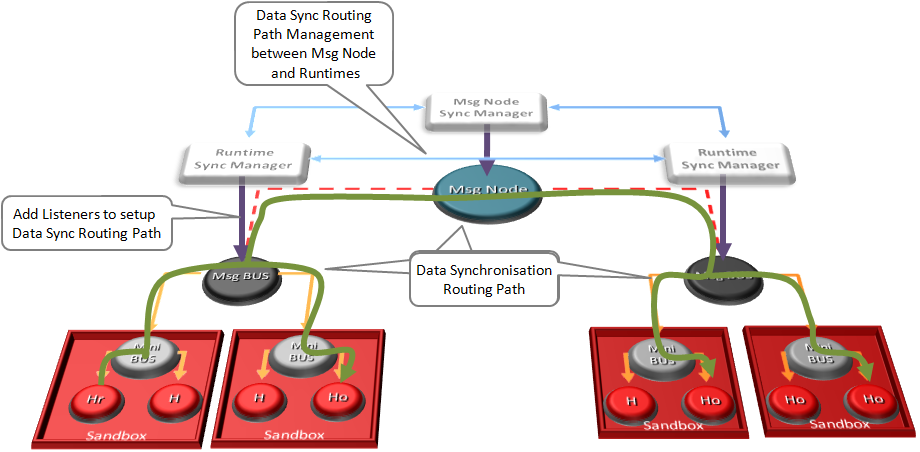

P2P Data Synchronisation: Reporter - Observer Model
---------------------------------------------------

This document gives an overview on how Hyperties cooperate each other through a Data Synchronisation model called Reporter - Observer. Details about how to develop Hyperties based on this model is provided in [this](development-of-hyperties.md) document.

The usage of Data synchronisation models in [Web Frameworks](https://www.meteor.com/ddp) looks very promising and is becoming very popular. The usage of the emerging [object.observe](https://developer.mozilla.org/pt-PT/docs/Web/JavaScript/Reference/Global_Objects/Object/observe) javascript API is making it even more appealing. However, current solutions require server-side databases that has an impact on performance and scalability.

Hyperty Reporter - Observer communication pattern goes beyond current solutions by using a P2P Synchronisation solution for JSON Data Objects, here called Hyperty Data Object or Sync Data Object. To avoid concurrency inconsistencies among peers, only one peer has granted writing permissions in the Hyperty Data Object - the **Reporter hyperty** - and all the other Hyperty instances who has permissions to read the Hyperty Data Object - the **Observer hyperty**.

The API to handle Hyperty Data Objects is extremely simple and fun to use. The Developer of the Hyperty Reporter just has to create the Data Sync object with the Syncher API, and write on the object every time there is data to be updated and shared with Hyperty Observers.

*Reporter code snippet*

On the Hyperty Observer side, Data Objects are also created with the Syncher API and the emerging [Object.observer() Javascript method](https://developer.mozilla.org/en-US/docs/Web/JavaScript/Reference/Global_Objects/Object/observe) is used to receive the stream of data changes coming from the Reporter Hyperty.

*Observer code snippet*

### Parent - Children Resources

In order to allow use cases like Group Chat where all involved Hyperties are able to write in the Sync Data Object, the Parent - Child Data Sync Objects is introduced.

A Data Object Child belongs to a Data Object Parent children resource and can be created by any Observer of the Data Object Parent as well as by its Reporter. The Reporter - Observer rules still apply to Data Object Child i.e. there is only one Reporter that can update the Data Object Child, which can be an Observer of the Data Object Parent, as mentioned earlier.

The creation, update and delete of an Data Object Child is performed in the Data Object Parent itself:

*Data Object Child creation, update and delete code snippet*

All other Hyperties observing or reporting the Data Object Parent, will be notified every time a new Data Object Child is created, updated or deleted:

*Data Object Child creation, update and delete notification code snippet*

At this point, Data Object Child can't also be a Data Object Parent of another Sync Data Object, i.e. Hyperty Data Object composition is limited to one level.

### Syncher and Sync Manager

This section, gives an overview on how the Hyperty Data Object synchronisation transparently works on top of the [Hyperty Messaging Middleware](hyperty-messaging-middleware.md). However, Hyperty developers don't have to know the technical details of this solution and can directly move to the [Hyperty Development Manual](development-of-hyperties.md).

The Hyperty Data Object synchronisation is provided by two components in the Runtime:

The [Syncher](https://github.com/reTHINK-project/dev-service-framework/blob/master/src/syncher/Syncher.js) is a singleton Component co-located with the Hyperty Instance, which is in charge of handling all required procedures to manage data synchronisation at the Hyperty instance side, as a Reporter or a Observer Hyperty.

The [Sync Manager](https://github.com/reTHINK-project/dev-service-framework/blob/master/src/syncher/Syncher.js) is a Core Runtime Component, which is in charge of handling authorisation requests to create Sync Data Objects from Hyperty Reporters and subscription requests to Sync Data Objects from Hyperty Observers. As soon as authorisation is granted the Sync Manager handles all required MessageBUS listeners in order to setup the Data Sync Stream routing path among Reporters and Observers. I.e., the Sync Manager provides a [Messaging Middleware](hyperty-messaging-middleware.md) Routing Manager functionality.

A detailed description of the Hyperty Data Synchronisation procedures are provided [here](https://github.com/reTHINK-project/core-framework/blob/master/docs/specs/runtime/dynamic-view/data-sync/readme.md)
