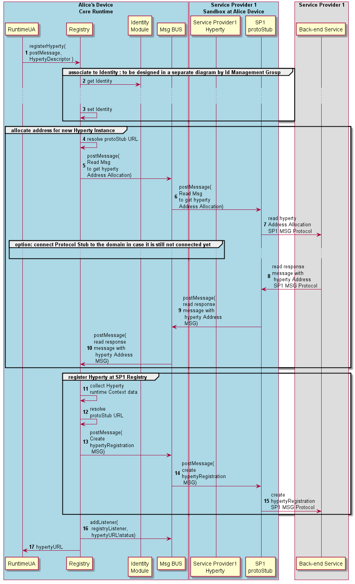

#### Register Hyperty

The Runtime procedures to register a new Hyperty are described in this section.



Step 1: the Hyperty registration is requested by the Runtime UA triggered by the [Hyperty Deployment process](deploy-hyperty.md) (section ?).

Steps 2 and 3: The Hyperty is associated to a certain [identity](../identity-management/user-to-hyperty-binding.md)(section 4.3.2.3)

Steps 4 - 10: an Hyperty URL address is allocated in cooperation with the Msg Node Address Allocation functionality.

**Message to request address allocated for new Hyperty Instance**

```
"id" : "1"
"type" : "CREATE",
"from" : "hyperty-runtime://<sp1>/<runalice>/registry/allocation",
"to" : "domain://msg-node.<sp1>/hyperty-address-allocation",
"body" : { "value" : {"number" : 5} }
```

**Response Message returning the requested Hyperty Instance address**

```
"id" : "1"
"type" : "RESPONSE",
"from" : "domain://msg-node.sp1/hyperty-address-allocation",
"to" : "hyperty-runtime://sp1/runalice/registry/allocation",
"body" : { "code": 200, "value" : {"allocated": ["hyperty://sp1/alice/hy123", ...]} }
```

Steps 11 - 15: the Hyperty instance is registered in the back-end Registry

**Message to Register new Hyperty Instance**

```
"id" : "1"
"type" : "CREATE",
"from" : "hyperty-runtime://<sp1>/runalice",
"to" : "registry.<sp1>",
"body" : { "value" : {"hypertyDescriptorURL" : "hyperty-catalogue://sp1/hy123", "hypertyURL" : "hyperty://sp1/alice/hy123",
"hypertyRuntimeURL" : "hyperty-runtime://sp1/runalice",
...} }
```

Steps 16 - 17: The runtime Registry adds its listener to be notified about Hyperty instance status and returns the Hyperty URL to the runtime UA
