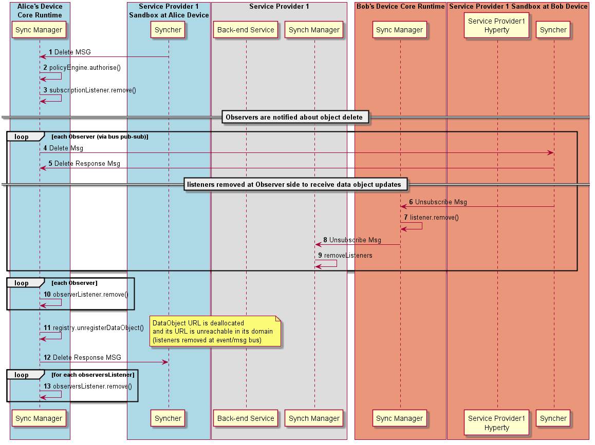

#### Data Object Delete by Reporter



Steps 1-2: The Data Object reporter post a Delete Message to stop the Data Object synchronisation.

**[Delete Message sent by Reporter](https://github.com/reTHINK-project/architecture/tree/master/docs/datamodel/message#deletemessagebody)**

```
"id" : "X"
"type" : "DELETE",
"from" : "hyperty://<sp1>/alicehy123",
"to" : "hyperty-runtime://<sp1>/<alice-device>/sm",
"body" : { "resource" : "comm://sp1/alice/123456" }
```

Steps : The Core Police Engine applies policies to check whether Alice has permissions to delete the data object. If yes the Sync Manager removes its subsription listener from the Msg BUS.

Steps : In case the data object deletion is authorised, the Sync Manager removes its subscription listener from the Msg BUS and sends a Delete message to all object Observers listening at <ObjectURL>/changes through the msg bus.

**[Delete Message sent to Observers](https://github.com/reTHINK-project/architecture/tree/master/docs/datamodel/message#deletemessagebody)**

```
"id" : "X"
"type" : "DELETE",
"from" : "hyperty-runtime://<sp1>/<alice-device>/sm",
"to" : "comm://sp1/alice/123456/changes"
```

Steps : optionally, Observers may confirm to aknowledge the reception of the delete.

**[Response to Delete Message sent by Observer](https://github.com/reTHINK-project/architecture/tree/master/docs/datamodel/message#responsemessagebody)**

```
"id" : "X"
"type" : "RESPONSE",
"from" : "hyperty://sp2/bobhy123",
"to" : "hyperty-runtime://<sp1>/<alice-device>/sm",
"body" : { "code" : "200"  }
```

Each Observer asks its Sync Manager to remove its listeners from the Bus through a Unsuscribe message (similar to the [Unsubscription procedure](data-object-unsubscription.md) )

The Sync Manager removes all authorised observerListeners that were added in the Msg BUS to receive the Data object updates (<ObjectURL>/changes resource).

Step : the data object is unregistered from the Registry.

Steps 4: The new address allocated to the Data Object is informed back to the Reporter with a response message.

**[Response Message by SM to inform Hyperty Owner that object was deleted](https://github.com/reTHINK-project/architecture/tree/master/docs/datamodel/message#deletemessagebody)**

```
"id" : "X"
"type" : "RESPONSE",
"from" : "hyperty-runtime://<sp1>/<alice-device>/sm",
"to" : "hyperty://sp1/alicehy123",
"body" : { "code" : "200", "value" : "{ "resource" : "comm://sp1-msg-node/alice/123456" } }
```

Steps : the Sync Manager removes all listeners that were added in the Msg BUS to be notified when new observers are added or removed (<ObjectURL>/observers resource).
