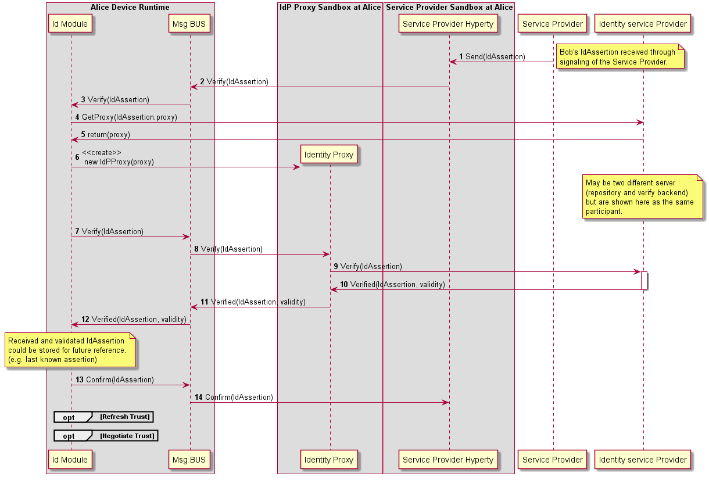

#### User identity assertion 

In this sequence, Alice Hyperty receives an Identity Assertion from its signaling/backend service.
Before prompting the user with the asserted identity (e.g. an incoming call notification) it must be verified.
The hyperty thus uses the Verification API to ask the runtime to verify the received assertion. Communication 
with the Runtime is done through the Msg bus. 

Upon receiving the verification request, the runtimeUA instantiate an IdP Proxy from a URL. This URL is given 
in the IdToken. Alternatively the IdP Proxy may already have been instantiated. Once instantiated, the RuntimeUA
uses it to verify the IdToken. Communication with the IdP Proxy is also done through the Msg bus. 

If the IdToken is validated, the RuntimeUA confirms the validity to the Hyperty. 
